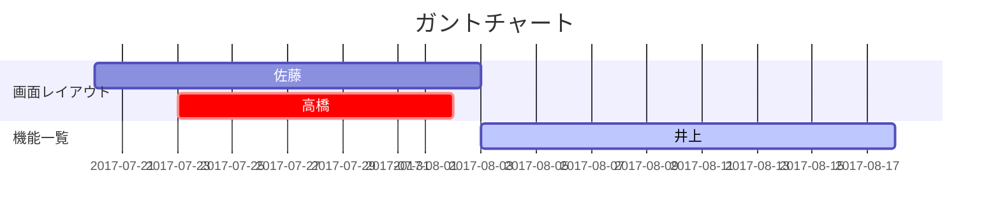

# 要求定義書の書き方
※指示）要件定義書はすべて[Markdown](https://docs.github.com/ja/get-started/writing-on-github/getting-started-with-writing-and-formatting-on-github/quickstart-for-writing-on-github)で記述してください。

Vscodeで記述する場合は、拡張機能「**Markdown All in One**」を導入したほうがよいです。
Vscodeでgithub風のMarkdownを記述する場合は、拡張機能 「**Markdown Preview Github Styling**」を導入したほうがよいです。

 --- 
>ヘッダーを作成してください。

 | 制作者 | 作成日付 | 承認者 | 承認日付 | 承認日付 |
 | ------ | -------- | ------ | -------- | -------- |
 | ○○○    | ○○○      | ○○○    | ○○○      | ○○○      |

- プロジェクト名：○○○○○○○○○○○○○ 
- ソフトウェア名：○○○○○○○○○○○○○ 

 --- 
## 1. システム概要

### 1-1. システムの背景と目的
  - 背景 </br> 
    ○○○○○○○○○○○○○○○○○○   
    ○○○○○○○○○○○○○○○○○○   
    ○○○○○○○○○○○○○○○○○○  
 </br> 
  - 目的 </br> 
    ○○○○○○○○○○○○○○○○○○   
    ○○○○○○○○○○○○○○○○○○   
    ○○○○○○○○○○○○○○○○○○  

    #### 1-1-1. 業務要件の確認

    ##### 利用者一覧
     - ○○○○○○○○○○○○○○○○○○  
     - ○○○○○○○○○○○○○○○○○○
       
    ##### 現状のフロー
      ○○○○○○○○○○○○○○○○○○ 
     
     1. ○○○○○○○○○○○○○○○○○○ 
     2. ○○○○○○○○○○○○○○○○○○ 
     3. ○○○○○○○○○○○○○○○○○○ 
     4. ○○○○○○○○○○○○○○○○○○ 
     5. ○○○○○○○○○○○○○○○○○○ 
     6. ○○○○○○○○○○○○○○○○○○ 
     
     #### 改修後のフロー
      ○○○○○○○○○○○○○○○○○○ 
     
     1. ○○○○○○○○○○○○○○○○○○ 
     2. ○○○○○○○○○○○○○○○○○○ 
     3. ○○○○○○○○○○○○○○○○○○ 
     4. ○○○○○○○○○○○○○○○○○○ 
     5. ○○○○○○○○○○○○○○○○○○ 
     6. ○○○○○○○○○○○○○○○○○○ 
   
 --- 


### 1-2. ユースケース図
> ※指示）ユースケース図は**Mermaid**または**PlantUML**で作成し、そのURLリンクを本文に挿入すること。 
>  図表の記載に Mermaid を利用する場合は、vscodeに 拡張機能「**Markdown Preview Mermaid Support**」「**Markdown Preview Enhanced** 」をインストールするとよい。
> ユースケースには「ユースケースID」を設定すること。 
 
 ＜ユースケースIDとユースケースの対応表＞ 
[marmaidでユースケース図](./%E3%83%A6%E3%83%BC%E3%82%B9%E3%82%B1%E3%83%BC%E3%82%B9%E5%9B%B3.md)

 例）  
   UC001：顧客情報を検索する  
   UC002：配達内容を確認する  
   ○○○○○：○○○○○○○○

 --- 
### 1-3. システムの全体図
> ※指示）全体図は**draw.io**や**PlantUML**、**marmeid** で作成し、そのURLリンクを本文に挿入すること。

#### ソフトウェア構成
    ○○○○○○○○○○○○○○○○○○ 
    ○○○○○○○○○○○○○○○○○○ 
    ○○○○○○○○○○○○○○○○○○ 

#### ハードウェアの構成
    ○○○○○○○○○○○○○○○○○○ 
    ○○○○○○○○○○○○○○○○○○ 
    ○○○○○○○○○○○○○○○○○○ 

#### ネットワークの構成
    ○○○○○○○○○○○○○○○○○○ 
    ○○○○○○○○○○○○○○○○○○ 
    ○○○○○○○○○○○○○○○○○○ 

#### 実行環境
    ○○○○○○○○○○○○○○○○○○ 
    ○○○○○○○○○○○○○○○○○○ 
    ○○○○○○○○○○○○○○○○○○ 

 --- 
### 1-4. 要求一覧
> ※指示）アプリケーションに求められる要件を、大分類、小分類、要件、優先度、備考等に分けて表形式で記述する
  

 --- 
#### 1-5. 開発スケジュール
> ※指示）10月末の検収日としてスケジュールを設定してください。
> 図表は、**Mermaid**または**PlantUML**により作成してください。
> 「**Markdown Preview Mermaid Support**」「**Markdown Preview Enhanced**」をインストールするとよい。
>(参考URL)  
>[GitHub で Mermaid がサポートされました](https://zenn.dev/yasuhiroki/articles/dd0feae790ba41)  
>[PlantUMLでガントチャート](https://plantuml.com/ja-dark/gantt-diagram)

 | No             | タスク名      | 開始日  | 内容    |
 | -------------- | ------------- | ------- | ------- |
 | YYYY年MM月DD日 | ○○○○○○○○○○○○○ | ○○○○○○○ | ○○○○○○○ |
 | YYYY年MM月DD日 | ○○○○○○○○○○○○○ | ○○○○○○○ | ○○○○○○○ |
 | YYYY年MM月DD日 | ○○○○○○○○○○○○○ | ○○○○○○○ | ○○○○○○○ |
 | YYYY年MM月DD日 | ○○○○○○○○○○○○○ | ○○○○○○○ | ○○○○○○○ |

###### marmaidで記載した例



#### 1-6. 担当表
> ※指示）4名の開発要員で構成してください。

    ○○○○○○○○○○○○○○○○○○ 
    ○○○○○○○○○○○○○○○○○○ 
    ○○○○○○○○○○○○○○○○○○ 


 --- 
## 2. 機能要件

### 機能一覧
> ※指示）No、機能名、機能ID、処理名、詳細に分けて ** 表形式 ** で記述する


### 用語定義
> 必要に応じて記載してください。

  ○○○○○○○○○○○○○○○○○○ 

- ○○○○○○○○○○○○○○○○○○ 
○○○○○○○○○○○○○○○○○○　
- ○○○○○○○○○○○○○○○○○○　  
○○○○○○○○○○○○○○○○○○　
- ○○○○○○○○○○○○○○○○○○　  
○○○○○○○○○○○○○○○○○○　
- ○○○○○○○○○○○○○○○○○○　  
○○○○○○○○○○○○○○○○○○　


## 2. 画面設計

### 2.1 画面一覧
> ※指示）No、画面名、画面ID、説明、概要に分けて表形式で記述する

### 2.2 画面遷移図
> ※指示）状態遷移図（ステートマシン図）をPlantUMLで作成し、そのURLリンクを本文に挿入すること。 

### 2.3 画面レイアウト
>※指示） 画面レイアウト図はsvgファイルとし、レイアウト図ごとに「No+画面ID+画面名」をファイル名としたmdファイルを作成する

#### 2.4 画面レイアウト書

- 画面ID、画面名称、概要を記載する  
  | 画面ID | 画面名称 | 概要         |
  | ------ | -------- | ------------ |
  | ○○○    | ○○○○○○   | ○○○○○○○○○○○○ |

- 画面が持つ機能を記載する
- 画面レイアウト図(svgk形式)へのリンクを記載する
- 入力、ボタン等がある場合には、別表に識別ID、ラベル、部品名称、説明を記載する


### 2.5 画面間のデータフロー図
> ※指示) 必要に応じて作成する
> 図表は、**Mermaid**または**PlantUML**により作成してください。
○○○○○○○○○○○○○○○○○○
```Mermaid
stateDiagram
    direction LR
    [*] --> A
    A --> B
    B --> C
    state B {
      direction LR
      a --> b
    }
    B --> D
```

1. ○○○○○○○○○○○○○○○○○○
1. ○○○○○○○○○○○○○○○○○○
1. ○○○○○○○○○○○○○○○○○○
1. ○○○○○○○○○○○○○○○○○○
1. ○○○○○○○○○○○○○○○○○○
1. ○○○○○○○○○○○○○○○○○○

## 3. 非機能要件

> ※指示) 必要に応じて作成する
